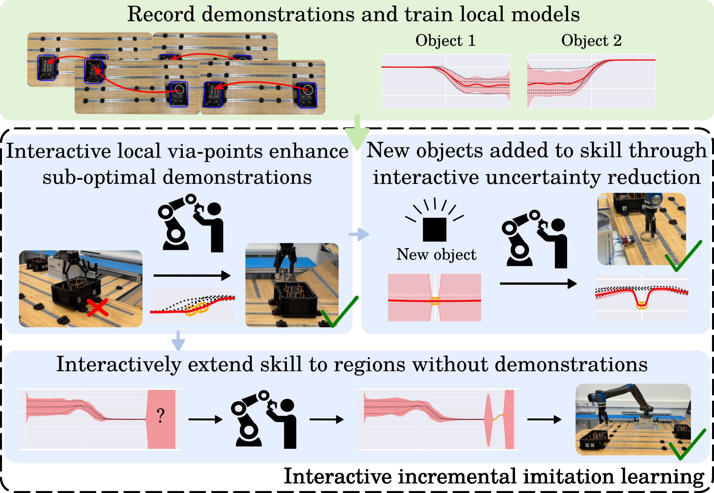
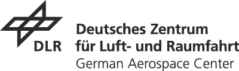

# Interactive incremental learning of generalizable skills with local trajectory modulation

Authors: Markus Knauer, Alin Albu-Schäffer, Freek Stulp and João Silvério

Responsible: Markus Knauer (markus.knauer@dlr.de) 
Research Scientist @ German Aerospace Center (DLR), Institut of Robotics and Mechatronics, Munich, Germany &
Doctoral candidate @ Technical University Munich (TUM).

This repository contains further information of our RA-L paper.

[ArXiv paper](https://arxiv.org/abs/2409.05655) | [RA-L paper (tbd)]() | [YouTube](https://youtu.be/nqigz0l1syA)

<div align="center">
  <a href="https://www.youtube.com/watch?v=nqigz0l1syA"></a>
</div>


## Overview

### Contributions
<div align="center">
  </a>
</div>


## Citation 

If you use our ideas in a research project or publication, please cite as follows:

```
@ARTICLE{knauer2025,
  author={Knauer, Markus and Albu-Schäffer, Alin and Stulp, Freek and Silvério, João},
  journal={IEEE Robotics and Automation Letters}, 
  title={Interactive incremental learning of generalizable skills with local trajectory modulation}, 
  year={2025},
  keywords={Incremental Learning; Imitation Learning; Continual Learning},
  doi={}}
}
```

---

<div align="center">
  <a href="https://www.dlr.de/EN/Home/home_node.html"></a>
</div>
