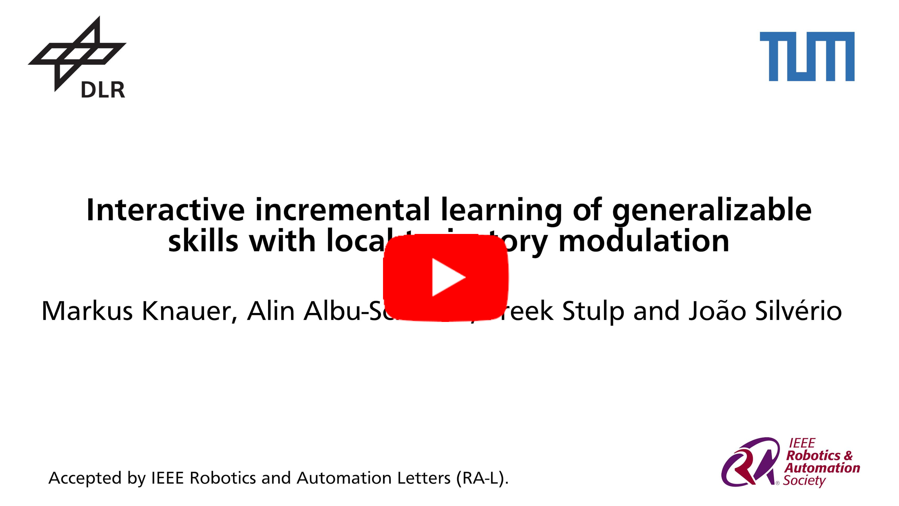

# Interactive incremental learning of generalizable skills with local trajectory modulation
<base target="_blank">

Authors: Markus Knauer, Alin Albu-Schäffer, Freek Stulp and João Silvério

Responsible: Markus Knauer (markus.knauer@dlr.de) 
Research Scientist @ German Aerospace Center (DLR), Institut of Robotics and Mechatronics, Munich, Germany &
Doctoral candidate & Teaching Assistant @ Technical University Munich (TUM).

This repository contains further information on our RA-L paper.

[RA-L paper](https://ieeexplore.ieee.org/document/10887119/) | [ArXiv paper](https://arxiv.org/abs/2409.05655) | [YouTube](https://youtu.be/nqigz0l1syA)


## Video (Link to YouTube)
*Ctrl+Click to open links in a new tab*

<div align="center">
  <a href="https://www.youtube.com/watch?v=nqigz0l1syA" target="_blank"></a>
</div>

## Overview

### Abstract
The problem of generalization in learning from demonstration (LfD) has received considerable attention over the years, particularly within the context of movement primitives, where a number of approaches have emerged. Recently, two important approaches have gained recognition. While one leverages via-points to adapt skills locally by modulating demonstrated trajectories, another relies on so-called task-parameterized models that encode movements with respect to different coordinate systems, using a product of probabilities for generalization. While the former are well-suited to precise, local modulations, the latter aim at generalizing over large regions of the workspace and often involve multiple objects. Addressing the quality of generalization by leveraging both approaches simultaneously has received little attention. In this work, we propose an interactive imitation learning framework that simultaneously leverages local and global modulations of trajectory distributions. Building on the kernelized movement primitives (KMP) framework, we introduce novel mechanisms for skill modulation from direct human corrective feedback. Our approach particularly exploits the concept of via-points to incrementally and interactively 1) improve the model accuracy locally, 2) add new objects to the task during execution and 3) extend the skill into regions where demonstrations were not provided. We evaluate our method on a bearing ring-loading task using a torque-controlled, 7-DoF, DLR SARA robot.

**Keywords:** *Incremental Learning*, *Imitation Learning*, *Continual Learning*, *Robotics*

### Contributions
<div align="center">
  <a href="https://arxiv.org/abs/2409.05655" target="_blank"></a>
</div>


## Citation 

If you use our ideas in a research project or publication, please cite as follows:

```
@ARTICLE{knauer2025,
  author={Knauer, Markus and Albu-Sch{\"a}ffer, Alin and Stulp, Freek and Silv{\'e}rio, Jo{\~a}o},
  journal={IEEE Robotics and Automation Letters (RA-L)}, 
  title={Interactive incremental learning of generalizable skills with local trajectory modulation}, 
  year={2025},
  keywords={Incremental Learning; Imitation Learning; Continual Learning},
  doi={10.1109/LRA.2025.3542209}}
}
```

---

<div align="center">
  <a href="https://www.dlr.de/EN/Home/home_node.html"></a>
</div>
