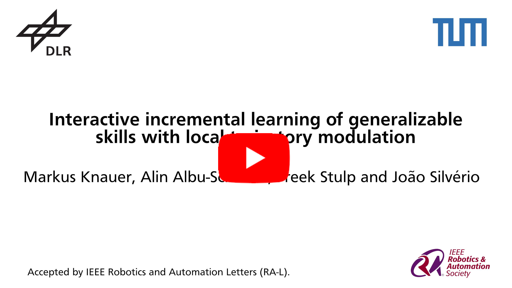
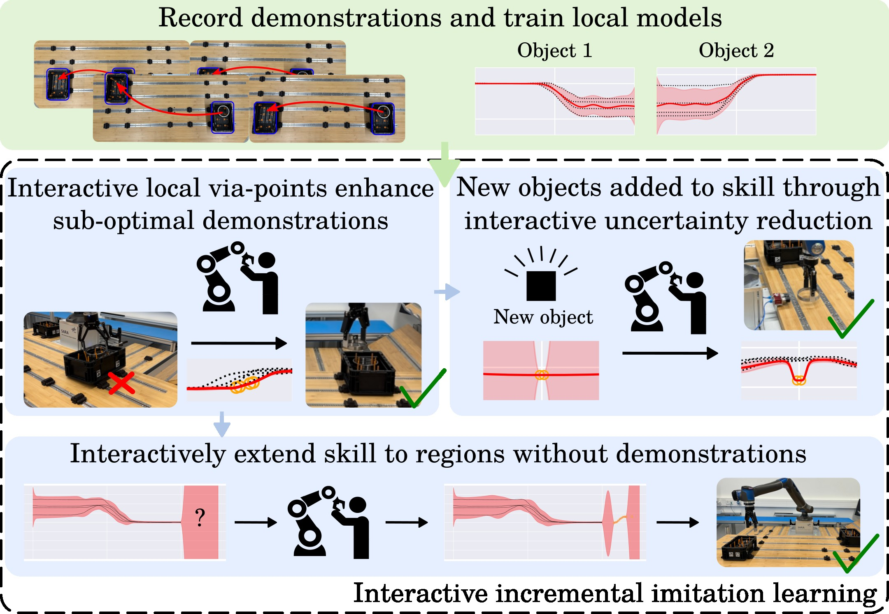

# Interactive incremental learning of generalizable skills with local trajectory modulation

[](https://opensource.org/licenses/MIT)
[](https://www.python.org/downloads/)
[](https://github.com/DLR-RM/interactive-incremental-learning/actions/workflows/ci.yml)

<base target="_blank">

Authors: [Markus Knauer](https://markusknauer.github.io/), Alin Albu-Schäffer, Freek Stulp, and João Silvério

Responsible: Markus Knauer (markus.knauer@dlr.de)
Research Scientist @ German Aerospace Center (DLR), Institute of Robotics and Mechatronics, Munich, Germany &
Doctoral candidate & Teaching Assistant @ Technical University of Munich (TUM), Germany.

This repository contains the code to reproduce the experiments from our RA-L paper.

If you are interested, you can find similar projects on [https://markusknauer.github.io](https://markusknauer.github.io/)

[RA-L paper](https://ieeexplore.ieee.org/document/10887119/) | [ArXiv paper](https://arxiv.org/abs/2409.05655) | [ELIB paper](https://elib.dlr.de/212796/) | [YouTube](https://youtu.be/nqigz0l1syA)


## Video (Link to YouTube)
*Ctrl+Click to open links in a new tab*

<div align="center">
  <a href="https://www.youtube.com/watch?v=nqigz0l1syA" target="_blank"></a>
</div>


## Overview

### Abstract
The problem of generalization in learning from demonstration (LfD) has received considerable attention over the years, particularly within the context of movement primitives, where a number of approaches have emerged. Recently, two important approaches have gained recognition. While one leverages via-points to adapt skills locally by modulating demonstrated trajectories, another relies on so-called task-parameterized models that encode movements with respect to different coordinate systems, using a product of probabilities for generalization. While the former are well-suited to precise, local modulations, the latter aim at generalizing over large regions of the workspace and often involve multiple objects. Addressing the quality of generalization by leveraging both approaches simultaneously has received little attention. In this work, we propose an interactive imitation learning framework that simultaneously leverages local and global modulations of trajectory distributions. Building on the kernelized movement primitives (KMP) framework, we introduce novel mechanisms for skill modulation from direct human corrective feedback. Our approach particularly exploits the concept of via-points to incrementally and interactively 1) improve the model accuracy locally, 2) add new objects to the task during execution and 3) extend the skill into regions where demonstrations were not provided. We evaluate our method on a bearing ring-loading task using a torque-controlled, 7-DoF, DLR SARA robot.

**Keywords:** *Incremental Learning*, *Imitation Learning*, *Continual Learning*, *Robotics*

### Contributions
<div align="center">
  <a href="https://arxiv.org/abs/2409.05655" target="_blank"></a>
</div>


## Setup

Create and activate the conda environment:

```bash
conda env create -f requirements.yaml
conda activate tpkmp
```

If you don't have conda installed, follow the [installation guide](https://docs.conda.io/projects/conda/en/latest/user-guide/install/linux.html).


## Running the Experiments

Run all four experiments:

```bash
python interactive_incremental_learning/main.py --experiment 0123 --plot
```

Or run individual experiments:

```bash
# Experiment 0: Generalization to new frame configurations
python interactive_incremental_learning/main.py --experiment 0 --plot

# Experiment 1: Adding via-points to refine the trajectory
python interactive_incremental_learning/main.py --experiment 1 --plot

# Experiment 2: Adding a new reference frame during execution
python interactive_incremental_learning/main.py --experiment 2 --plot

# Experiment 3: Computing variable stiffness from uncertainty
python interactive_incremental_learning/main.py --experiment 3 --plot
```

See [experiments/README.md](interactive_incremental_learning/experiments/README.md) for expected outputs and detailed descriptions.

## Tests

```bash
make pytest
```

## Development

Install in editable mode with test dependencies:

```bash
pip install -e ".[tests]"
```

Run all checks:

```bash
make commit-checks   # format + type check + lint
make pytest          # run tests with coverage
```

See [CONTRIBUTING.md](CONTRIBUTING.md) for more details.

## Citation

If you use our ideas in a research project or publication, please cite as follows:

```
@ARTICLE{knauer2025,
  author={Knauer, Markus and Albu-Sch{\"a}ffer, Alin and Stulp, Freek and Silv{\'e}rio, Jo{\~a}o},
  journal={IEEE Robotics and Automation Letters (RA-L)},
  title={Interactive incremental learning of generalizable skills with local trajectory modulation},
  year={2025},
  volume={10},
  number={4},
  pages={3398-3405},
  keywords={Incremental Learning; Imitation Learning; Continual Learning},
  doi={10.1109/LRA.2025.3542209}
}
```

---

<div align="center">
  <a href="https://www.dlr.de/EN/Home/home_node.html"></a>
</div>
