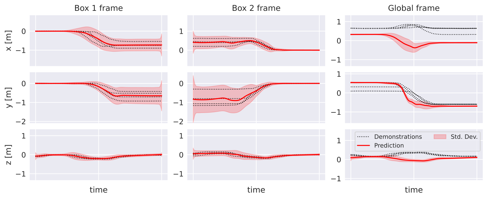
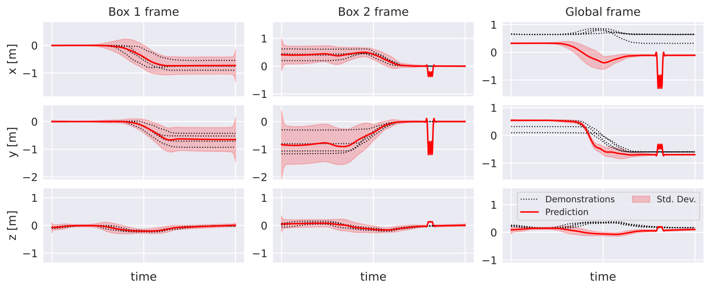
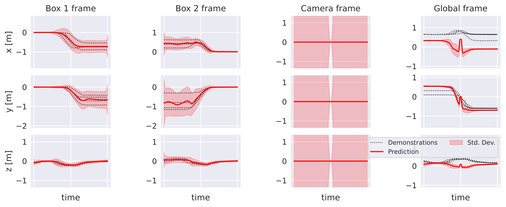
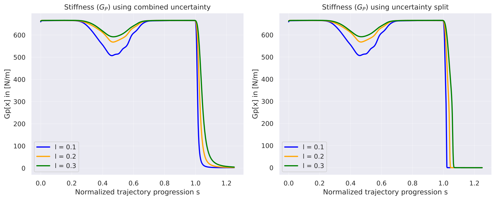
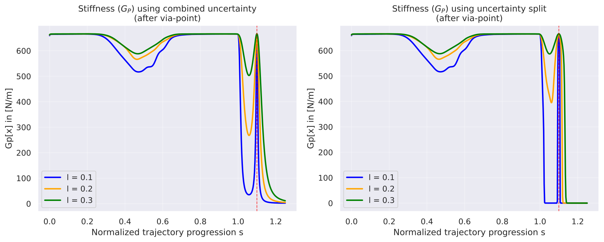

# Experiments

These experiments reproduce the results from the paper:

> M. Knauer, A. Albu-Schäffer, F. Stulp and J. Silvério, "Interactive Incremental Learning of Generalizable Skills With Local Trajectory Modulation," IEEE Robotics and Automation Letters (RA-L), vol. 10, no. 4, pp. 3398-3405, April 2025

Run all experiments:
```bash
python interactive_incremental_learning/main.py --experiment 0123 --plot
```

## Experiment 0: Generalization

Predicts a trajectory for a new spatial configuration of the two reference frames (boxes). The left two columns show local predictions in each frame's coordinate system; the right column shows the fused global prediction.



## Experiment 1: Adding Via-Points

Adds via-points at t=0.80-0.82 to constrain the trajectory endpoint. Notice how the uncertainty collapses near the via-points (Box 2 frame and Global frame) while the prediction is pulled toward the desired position.



## Experiment 2: Adding Frames

A third reference frame (camera) is dynamically added to the scene. The global trajectory is modified by the additional constraint from the new frame around t=0.5.



## Experiment 3: Variable Stiffness

Computes adaptive stiffness profiles from the uncertainty estimates for the x dimension. The left plot uses the standard KMP covariance (eq. 3); the right plot uses our approach that separates epistemic and aleatoric uncertainties (eq. 5). The different line colors correspond to different kernel lengths l. The trajectory extends beyond the training range (t > 1.0) to show out-of-distribution behavior.

**Before adding via-points (Figure 7):** The separated approach makes the stiffness approach zero faster after t=1.0, with lower sensitivity to l.



**After adding a via-point (Figure 8):** A via-point at t=1.10 (red dashed line) increases stiffness at that location, while our approach keeps the robot compliant in regions without data.


